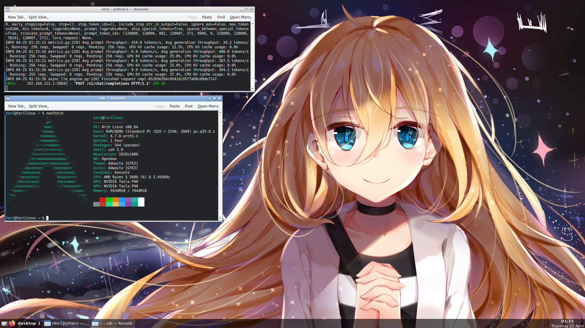

# ToriLinux - Linux LiveCD for offline AI training and inference

LiveCD distribution based on [ArchLinux](https://archlinux.org/) and currently includes the following projects preinstalled, along with their dependencies:
* [automatic](https://github.com/vladmandic/automatic)
* [axolotl](https://github.com/OpenAccess-AI-Collective/axolotl)
* [ComfyUI](https://github.com/comfyanonymous/ComfyUI)
* [koboldcpp](https://github.com/LostRuins/koboldcpp)
* [llama.cpp](https://github.com/ggerganov/llama.cpp)
* [SillyTavern](https://github.com/SillyTavern/SillyTavern)
* [SillyTavern-Extras](https://github.com/SillyTavern/SillyTavern-Extras)
* [text-generation-inference](https://github.com/huggingface/text-generation-inference)
* [text-generation-webui](https://github.com/oobabooga/text-generation-webui)
* [vllm](https://github.com/vllm-project/vllm)

If you would like to see another AI-related project included in ToriLinux, please open an [issue](https://github.com/sasha0552/ToriLinux/issues/new).

## Features

* Easy setup: just boot the ISO, and you will have a working setup for training and/or inferencing Large Language Models/Stable Diffusion/etc.
* Fully offline training and/or inference.
* Includes performance state switcher, which reduces GPU temperatures when inference is not running (only on NVIDIA, `automatic`, `koboldcpp`, `llama.cpp`, `vllm` supported).

## Usage

To use ToriLinux:
1. Install [Ventoy](https://ventoy.net/en/doc_start.html) on a USB drive.
2. Download the latest ISO from workflows and copy it to the USB drive.
3. Boot from the USB drive (select it as the boot device in BIOS/UEFI).
4. Log in with the username `tori` and password `tori`. You can also use [SSH](https://en.wikipedia.org/wiki/Secure_Shell).

The following options are currently available:
1. Headless: Headless variant without GUI, for servers.
2. With GUI: A variant with a GUI, for desktops.
3. Empty: A variant WITHOUT projects, with CUDA/ROCm only.

|        | Headless | With GUI | Empty |
|--------|----------|----------|-------|
| NVIDIA | [NVIDIA headless](https://github.com/sasha0552/ToriLinux/actions/workflows/gh-build-iso-cuda.yml?query=branch%3Amain) | [NVIDIA with GUI](https://github.com/sasha0552/ToriLinux/actions/workflows/gh-build-iso-cuda-gui.yml?query=branch%3Amain) | [NVIDIA empty](https://github.com/sasha0552/ToriLinux/actions/workflows/gh-build-iso-cuda-empty.yml?query=branch%3Amain) |
| AMD | [AMD headless](https://github.com/sasha0552/ToriLinux/actions/workflows/sh-build-iso-rocm.yml?query=branch%3Amain) | [AMD with GUI](https://github.com/sasha0552/ToriLinux/actions/workflows/sh-build-iso-rocm-gui.yml?query=branch%3Amain) | [AMD empty](https://github.com/sasha0552/ToriLinux/actions/workflows/sh-build-iso-rocm-empty.yml?query=branch%3Amain) |

## Misc

Note that you need pre-downloaded models on a local hard drive or NFS server, or enough RAM and internet connection to download models directly into RAM.

Note that following projects is not available on ROCm version:
* [axolotl](https://github.com/OpenAccess-AI-Collective/axolotl)
* [text-generation-inference](https://github.com/huggingface/text-generation-inference)
* [vllm](https://github.com/vllm-project/vllm)

The server for building the ROCm version is provided by [@Sepera-okeq](https://github.com/Sepera-okeq/).
